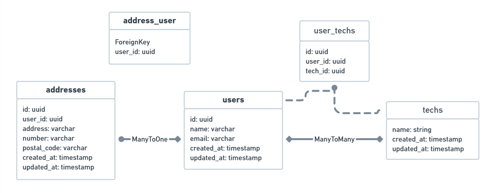

# Basic CRUD RESTful API built with JavaScript, Sequelize and PostgreSQL ⚙

[](https://developer.mozilla.org/pt-BR/docs/Web/JavaScript) [](https://nodejs.org/en/) [](https://sequelize.org/master/)

Simple CRUD of Users, Addresses and Techs applying the techs JavaScript, Sequelize, Node.JS and PostgreSQL.


## After cloning the repository

Execute the following command to install all of the project's dependencys:

```bash
yarn
```

## Creating the DB with Docker 🐳

Execute the following commando on your terminal to create a new image with the PostgreSQL DB:

```bash
docker-compose -f docker-compose.yml up -d
```

> After the execution an image called a execução a imagem backend-sequelize-nodejs will be generated on your Docker 

## Creating the basic structure of the DB 🐘

Para criar as tabelas no banco de dados, execute o seguinte comando:

```bash
yarn sequelize db:migrate
```

## Structure of the DB 🗃




# Executing the project ▶

To execute the project, run the following command on your terminal:

```bash
yarn dev
```

> If things are running smoothily you should get a message: Back-end started on port 3333! 🚀

# Access the documentation with all the API endpoints 🐱‍🚀
[](https://tinyurl.com/backend-api-sequelize)